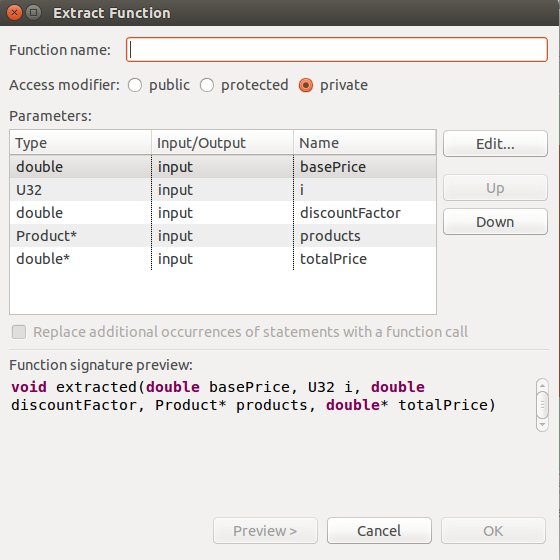

# Effective Refactoring 2

## 如何实施重构

稍微复杂的重构过程，都是由一系列的基本重构手法组成. 《重构》一书中针对各种重构场景，给出了大量的重构手法.这些手法有的复杂，有的简单，如果不加以系统化的整理和提炼，很容易迷失在细节中.
另外，在不同场景下重构手法的使用是非常讲究其顺序的.一旦顺序不当，很容易让重构失去安全性，或者干脆让某些重构变得很难完成.
本节是个人对重构手法的整理和提炼，帮助大家跳出细节，快速掌握重要的重构手法并且能够尽快在自己的重构实践中进行使用.随后我们整理了重构手法应用顺序的背后思想，帮助大家避免死记硬背，可以根据自己的重构场景推导出合理的重构顺序.

### 基本手法

根据2-8原则，我们平时80%的工作场景中只使用到20%的基本重构手法. 而往往复杂的重构手法，也都是由一些小的基本手法组合而成. 熟练掌握基本手法，就能够完成绝大多数重构任务. 再按照一定顺序对其加以组合，就能够完成大多数的复杂重构.

经过对《重构》一书中的所有重构手法进行分析，结合日常工作中的使用情况，我们认为以下几类重构手法为基本手法:
- 重命名 (rename)
- 提炼 (extract)
- 内联 (inline)
- 移动 (move)

以上每一类的命名皆是动词，其宾语可以是变量，函数，类型。对于某些语言，例如C/C++，还应该再包含文件（特质物理重构）.
例如重命名，包含重命名变量，重命名函数，重命名类，以及重命名文件，它们皆为基本重构手法，都属于重命名这一类.

其它所有的重构手法大多数都是上述基本手法的简单变异，或者干脆由一系列基本手法组成.
例如常用的`Self Encapsulate Field(自封装字段)`，本质上就是简化版的`Extract Method`.
再例如稍微复杂的`Replace Condition with Polymorphism(以多态取代条件表达式)`，就是由`Extract Method` 和 `Move Method`组成的.

所以我们学习重构手法，只要能够熟练掌握上面四类基本手法，就可以满足日常绝大多数重构场景.通过对基本重构手法的组合，我们就能完成复杂的重构场景.

### 原子步骤
在我们提炼出了上述四类基本手法后，我们还是想问，既然重构手法都是代码等价变化操作，它们背后是否存在哪些共性的东西? 因为即使是四类基本手法，展开后也包含了不少手法，而且要去死记硬背每种手法的具体操作过程，也是相当恼人的.
事实上每种重构手法为了保证代码的等价变化，必须是安全且小步的，其背后的操作步骤都是相似的.我们对组成每种基本重构手法的步骤加以整理和提炼，形成一些原子步骤.一项基本重构手法是由原子步骤组成的.每一个原子步骤实施之后我们保证代码的功能等价性.

我们可以认为，基本上重构手法都是由以下两个有序的原子步骤组成:
1. **setup**
    - 根据需要创建一个新的代码元素. 例如:变量，函数，类，或者文件
    - 新创建的代码元素需要有好的名称，更合适的位置和访问性.更好体现出设计意图
    - 新的代码元素的实现，可以**copy**原有代码，在copy过来的代码基础之上进行修改.(注意是**copy**)
    - 这一原子步骤的操作过程中，不会对原有代码元素进行任何修改.
    - 这一过程的安全性只需要**编译**的保证

2. **substitute**
	- 将原子步骤1中新创建的代码元素替换回原有代码
	- 这一过程需要搜索待替换元素在老代码中的所有引用点
	- 对引用点进行逐一替换; 一些场景下为了方便替换，需要先创建引用"锚点"
	- 这一过程是一个修改源代码的过程，所以每一次替换之后，都应该由**测试**来保证安全性

原子步骤1，2的交替进行，可以完成一项基本重构或者复杂重构. 在这里1和2可以称之为原子步骤，除了因为大多数的重构手法可以拆解成这两个原子步骤.更是因为每个原子步骤也是一项代码的等价变换(只是层次更低)，严苛条件下我们可以按照原子步骤的粒度进行代码的提交或者回滚.然而我们之所以不把原子步骤叫做手法，是因为原子步骤的单独完成往往不能独立达成一项重构目标. 灵活掌握了原子步骤的应用，我们除了不用死记硬背每种重构手法背后的繁琐步骤，更可以使自己的重构过程更安全和小步，做到更小粒度的提交和回滚，快速恢复代码到可用状态.

以下以两段C++代码做示例，展示如何应用原子步骤完成基本重构手法:
1. 重命名变量(Rename Variable)
    ~~~cpp
    unsigned int start = Date::getTime();
    // load program ...
    unsigned int offset = Date::getTime() - start;
    cout << "Load time was: " << offset/1000 << "seconds" << endl;
    ~~~
    在上面的示例代码中，变量`offset`的含义太过宽泛，我们将其重命名为`elapsed`，第一步我们执行原子步骤setup，创建一个新的变量`eclapsed`，并且将其初始化为`offset`.在这里为了更好的体现设计意图，我们将其定义为const.
    ~~~cpp
    unsigned int start = Date::getTime();
    // load program ...
    unsigned int offset = Date::getTime() - start;
    const unsigned int elapsed = offset;
    cout << "Load time was: " << offset/1000 << "seconds" << endl;
    ~~~
    经过这一步，我们完成了原子步骤1. 在这个过程中，我们只是增加了新的代码元素，并没有修改原有代码.新增加的代码元素体现了更好的设计意图. 最后我们编译现有代码，保证这一过程的安全性.
    接下来我们进行原子步骤substitute，首先找到待替换代码元素的所有引用点.对于我们的例子就是所有使用变量offset的地方.对于每个引用点逐一进行替换和测试.
    ~~~cpp
    unsigned int start = Date::getTime();
    // load program ...
    unsigned int offset = Date::getTime() - start;
    const unsigned int elapsed = offset;
    cout << "Load time was: " << elapsed/1000 << "seconds" << endl;
    ~~~
    最后别忘了变量定义之处的替换:
    ~~~cpp
    unsigned int start = Date::getTime();
    // load program ...
    const unsigned int elapsed = Date::getTime() - start;
    cout << "Load time was: " << elapsed/1000 << "seconds" << endl;
    ~~~
    每一次替换之后都需要运行测试，保证对源代码修改的安全性.
    
    在上述例子中，对于变量start和elapsed可以有更好的命名，这两个变量最好能够体现其代表时间的单位，例如可以叫做 startMs以及elapsedMs，大家可以自行练习替换. 另外程序中存在魔术数字1000，可以自行尝试用原子步骤进行`extract variable`重构手法，完成用变量对1000的替换.
    
2. 提炼函数 (Extract Method)
    ~~~cpp
    void printAmount(const Items& items)
    {
        int sum = 0;

        for(auto item : items)
        {
            sum += item.getValue();
        }

        cout << "The amount of items is " << sum << endl;
    }
    ~~~
    
    上述函数完成了两件事，首先统计一个items的集合的所有元素value的总和，然后对总和进行打印.
    为了把统计和打印职责分开，我们提炼一个函数`calcAmount`用来专门对一个给定的Items集合求总和.为了完成Extract Method重构手法，我们首先使用原子步骤setup. 
    
    首先建立`calcAmount`函数的原型，
    ~~~cpp
    int calcAmount(const Items& items)
    {
        return 0;
    }
    
    void printAmount(const Items& items)
    {
        int sum = 0;

        for(auto item : items)
        {
            sum += item.getValue();
        }

        cout << "The amount of items is " << sum << endl;
    }
    ~~~
    接下来完成`calcAmount`函数的实现.这一步需要将源函数中相关部分copy到`calcAmount`中并稍加修改.切记由于原子步骤1中不能修改源代码，所以这里千万不要用剪切，否则一旦重构出错，是很难快速将代码回滚到正确的状态的，这点新手尤其需要注意! 
    ~~~cpp
    int calcAmount(const Items& items)
    {
        int sum = 0;

        for(auto item : items)
        {
            sum += item.getValue();
        }

		return sum;
    }
    
    void printAmount(const Items& items)
    {
        int sum = 0;

        for(auto item : items)
        {
            sum += item.getValue();
        }

        cout << "The amount of items is " << sum << endl;
    }
    ~~~
    
    到目前为止，原子步骤1就已經OK了，我们运行编译，保证新增加的代码元素是可用的. 
    接下来我们进行原子步骤substitute.将新函数`calcAmount`替换到每一个对Items计算总量的地方.对于我们的例子，只有一个地方就是`printAmount`函数(相信对于真实代码，这类对Items求总量的计算会到处都是，写法各异).
    ~~~cpp
    int calcAmount(const Items& items)
    {
        int sum = 0;

        for(auto item : items)
        {
            sum += item.getValue();
        }

		return sum;
    }
    
    void printAmount(const Items& items)
    {
        cout << "The amount of items is " << calcAmount(items) << endl;
    }
    ~~~
    替换之后运行测试.到目前为止我们的Extract Method已经完成了.
    
    如果更进一步，我们发现可以运用基本重构手法Move Method将`calcAmount`函数移入到Items类中，然后使用Rename Method手法将其重命名为`getAmount`会更好. 对于Move Method和Rename Method大家可以发现，它们都是由我们总结的原子步骤组成. 例如Move Mehod，我们首先应用原子步骤setup，在Items类中创建public成员方法`calcAmount`，然后将函数的具体实现copy过去修改好，保证编译OK. 接下来应用原子步骤substitute，用新创建的Items成员函数替换老的CalcAmount，测试OK后，我们就完成了Move Method重构. 
    
    重构的最终效果如下，大家可自行练习.
    ~~~cpp
    struct Items
    {
        int getAmount() const;
        ...
    };
    
    void printAmount(const Items& items)
    {
        cout << "The amount of items is " << items.getAmount() << endl;
    }
    ~~~
    在这里我们没有将`printAmount`也移入到Items中，是因为`getAmount`作为Items的接口是稳定的.但是如何打印往往是表示层关注的，各种场景下打印格式各异，所以没有将其移入Items中.
    
通过上面的示例，我们演示了如何用原子步骤组合出基本的重构手法. 实际上，对于所有的rename和普通的extract重构，一般的`C++ IDE`都提供了直接的自动化重构快捷键供我们使用，平时开发直接使用重构快捷键即高效又安全.但是这并不影响我们掌握原子步骤的使用.由于`C++`语言的复杂性，大多数重构手法都是没有自动化重构快捷键支持的，即便有重构快捷键支持，一旦上下文稍微复杂一点(例如对有很多临时变量的函数执行Extract Method)，自动化重构的结果也往往不能让人满意. 这里不仅对C++语言，对于一些动态类型语言(例如ruby)，自动化重构更是匮乏.所以我们要掌握重构手法背后的思想，熟练掌握原子步骤，学会安全高效地手动重构.
    
这里总结的原子步骤是非常普适的! 不仅我们列举出的基本重构手法都是由原子步骤组成.对于许多复杂的重构手法，除了会直接使用基本重构手法，甚至也会直接使用原子步骤. 
例如对于Martin描述的手法"Replace Type Code with Class(以类取代类型码)"，里面基本是在反复使用原子步骤，我们摘录原书中的操作描述:

> 1. 为类型码建立一个类
> 2. 修改源类的实现，让它使用新建的类
> 3. 编译，测试
> 4. 对于源类中每一个使用类型码的函数，相应建立一个函数，让新函数使用新建的类
> 5. 逐一修改源类用户，让它们使用新接口
> 6. 每修改一个用户，编译并测试
> 7. 删除使用类型码的旧接口，并删除保存旧类型码的静态变量
> 8. 编译，测试

对于该重构，其中步骤1是原子步骤setup，步骤2是原子步骤substitute(第3步是对第2步的编译和测试，对第1步的编译过程作者省略了). 然后第4步又是setup，第5步开始执行substitute. 每一次按照原子步骤的要求进行执行，都可以保证重构是安全的，甚至严苛条件下，代码可以按照每一次原子步骤进行提交或者回滚. 另外对于每一种重构手法的操作描述，如果把它们统一成对原子步骤的组合的描述，也会极大的方便记忆. 掌握了原子步骤，即使忘记了某一项重构手法的具体操作，也可以方便的自行推导出来.

### 锚点的使用
在前面介绍原子步骤substitute的时候提到，为了方便替换，可以使用引用锚点.
对于重构，最容易出错的地方就在替换.可以借助IDE帮助自动搜索到对旧码元素的所有的引用点.但是搜索的质量往往和IDE以及语言特性相关.例如对于C++宏内代码元素的搜索，IDE就很难搜索准确. 另外对于引用点很多的情况，逐一替换/测试也是相当累人的.
所谓**锚点，就是先增加一个中间层，把所有对旧代码元素的引用汇聚到一点，编译测试过后，然后在这一个点完成新旧代码元素的统一替换.**
完成替换后，可以保留锚点，或者用inline重构手法再去掉锚点.

有两类手法经常被用来创建锚点，`Encapsulate field（自封装字段）`和`Replace Constructor with Factory Method(以工厂函数取代构造函数)`。

Encapsulate field一般在修改类的某一成员字段的实现方式的重构场景下使用。例如：`Move Field(在类间搬移字段)`和`Replace Type Code with Subclasses（以子类取代类型码）`。Encapsulate field对于欲修改字段创建引用锚点，将类内部对该成员字段的使用汇聚到一起，方便对字段的实现方式进行替换。它的操作方式也是由我们前面介绍的两个原子步骤组成：
- Setup：在类内创建两个方法分别对于要修改字段的读取和设值(就是面向对象初学者最爱写的`get`和`set`成员函数)。编译。
- Substitute：将类内所有直接使用字段的地方替换为调用对应的函数. 读取的地方替换为调用`get`，设值的地方替换为调用`set`。执行测试！

当执行完Encapsulate field后，类内再无对欲修改字段的直接使用了，这时就可以方便地在`get`和`set`方法内对于字段的实现方式进行修改了。

例如对于"Move Field(在类间搬移字段)"重构操作，首先就需要在源类内使用Encapsulate field对需要搬移的字段创建引用锚点. 当执行完Encapsulate field后，源类内再无对欲搬移字段的直接使用了，这个时候再在目标类中创建对应字段，将源类内`get`和`set`方法内对于自身字段的使用修改为使用目标类中的字段. 测试通过后，再删除源类内的搬移字段. 最后对于源类内提取出来的`get`和`set`方法可以再inline回去.

可以看到锚点将引用点汇聚到一处，每个客户都调用一个中间层，不再面对具体的待替换代码细节. 锚点的使用简化了替换过程，并且可以让替换更加安全.

在某些场合下使用锚点还有更重要的意义，一些重构手法必须借助锚点才能完成，尤其是对一些需要子类化的重构! 例如对于 `Replace Constructor with Factory Method(以工厂函数取代构造函数)`，在该重构手法里面，工厂函数就是锚点，它将类的创建汇聚到工厂函数里面，对客户代码隐藏了类的构造细节，后面如果进行某些子类化的重构就非常容易实施.

下面我们以一个例子作为对原子步骤和锚点的总结。
~~~cpp
// Shoes.h
enum Type
{
    REGULAR,
    NEW_STYLE,
    LIMITED_EDITION
};

struct Shoes
{
    Shoes(Type type, double price);
    double getCharge(int quantity) const;

private:
    Type type;
    double price;
};
~~~
~~~cpp
// Shoes.cpp
#include "Shoes.h"

Shoes::Shoes(Type type, double price) 
: type(type), price(price)
{
}

double Shoes::getCharge(int quantity) const
{
    double result = 0;

    switch(type)
    {
        case REGULAR:
            result += price * quantity;
            break;

        case NEW_STYLE:
            if(quantity > 1)
            {
                result += (price + (quantity - 1) * price * 0.8);
            }
            else
            {
                result += price;
            }

            break;

        case LIMITED_EDITION:
            result += price * quantity * 1.1;
            break;
    }

    return result;
}
~~~

以上代码中有一个`Shoes`类，它的`type`字段指明一个`Shoes`对象的具体类型：`REGULAR`、`NEW_STYLE`或者`LIMITED_EDITION`。`Shoes`类的接口`getCharge`根据传入的数量`quantity`来计算总费用。`getCharge`根据不同类型按照不同方法进行计算。对于普通款（REGULAR），总价等于单价乘以数量；对于新款（NEW_STYLE），从第二双开始打八折；对于限量版（LIMITED_EDITION），每一双需要多收10%的费用。

由于`Shoes`类的对象在其生命周期中`type`不会发生变化，所以可以为不同的类型码建立`Shoes`类型的子类，将不同`type`的计算行为放到相应子类中去，这样代码就可以满足开放封闭性，以后再增加新类型的`Shoes`，只用独立地再增加一个子类，不会干扰到别的类型的计算。
于是我们决定使用重构手法`Replace type code with subclasses（以子类取代类型码）`来完成重构目标。（注意：倘若在`Shoes`的对象生命周期内`type`可以变化，就不能使用该重构手法，而应该使用`Replace type code with strategy/state（以策略或者状态模式取代类型码）`）。

以下是具体的重构过程，我们着重展示如何使用原子步骤以及锚点。
1. 由于我们要以子类取代类型码`type`，所以首先使用Encapsulate field对`type`创建引用锚点，方便后面对`type`的替换。
	~~~cpp
	Type Shoes::getType() const
	{
		return type;
	}

	double Shoes::getCharge(int quantity) const
	{
		double result = 0;

		switch(getType())
		{
			case REGULAR:
				result += price * quantity;
				break;

			case NEW_STYLE:
				if (quantity > 1)
				{
					result += (price + (quantity - 1) * price * 0.8);
				}
				else
				{
					result += price;
				}

				break;

			case LIMITED_EDITION:
				result += price * quantity * 1.1;
				break;
		}

		return result;
	}
	~~~
	上面我们将`getCharge`中对`type`的直接使用替换为调用新创建的私有成员方法`getType()`。到最后`Shoes`内只有构造函数中仍然直接使用`type`，接下来再处理构造函数。
2. 为了屏蔽`Shoes`类型被子类化后对客户代码的影响，我们对`Shoes`创建工厂函数作为构造函数的引用锚点，用来对客户屏蔽不同种类`Shoes`的具体构造。首先执行原子步骤setup，创建出工厂函数。
	~~~cpp
	struct Shoes
	{
		static Shoes* create(Type type, double price);
		
		Shoes(Type type, double price);
		double getCharge(int quantity) const;

	private:
		Type getType() const;

	private:
		Type type;
		double price;
	};
	~~~
	~~~cpp
	Shoes* Shoes::create(Type type, double price)
	{
		return new Shoes(type, price);
	}
	~~~
	编译通过后，接下来执行原子步骤substitute。将原来客户代码直接调用`Shoes`构造函数的地方替换为调用工厂函数。替换完成后将`Shoes`的构造函数修改为`protected`(子类要用)。执行测试！
	~~~cpp
	struct Shoes
	{
		static Shoes* create(Type type, double price);
		
		double getCharge(int quantity) const;

	protected:
		Shoes(Type type, double price);
		
	private：
		Type getType() const;

	private:
		Type type;
		double price;
	};
	~~~
	~~~cpp
	// client code
	
	// Shoes* shoes = new Shoes(REGULAR, 100.0);
    Shoes* shoes = Shoes::create(REGULAR, 100.0);
	~~~
	为了简化，这里假设客户代码需要对创建出来的`Shoes`对象进行显示内存管理。
	
	至此内外部锚点都已经创建OK。内部锚点`getType`在类内屏蔽对`type`的直接使用，方便后续以子类对`type`进行替换。外部锚点`create`向客户隐藏`Shoes`的具体构造，方便以子类的构造替换具体类型`Shoes`的构造。
3. 接下来，我们逐一创建`Shoes`的子类，用于对`Shoes`中类型码的替换。
首先将`Shoes`内的`getType`函数修改为虚方法。然后执行原子步骤setup，创建类`RegularShoes`继承自`Shoes`，它覆写了`getType`方法，返回对应的类型码。
    ~~~cpp
	struct RegularShoes : Shoes
	{
		RegularShoes(double price);

    private:
		Type getType() const override;
	};
	~~~
	~~~cpp
	RegularShoes::RegularShoes(double price)
				: Shoes(REGULAR, price)
	{
	}

	Type RegularShoes::getType() const
	{
		return REGULAR;
	}
	~~~
	下面执行原子步骤substitute，用`RegularShoes`替换`Shoes`的构造函数中对于`REGULAR`类型的构造。
	~~~cpp
	Shoes* Shoes::create(Type type, double price)
	{
		if(type == REGULAR) return new RegularShoes(price);
		return new Shoes(type, price);
	}
	~~~
	同样的方式创建`NewStyleShoes`和`LimitedEditionShoes`，并替换进工厂函数中。
	~~~cpp
	NewStyleShoes::NewStyleShoes(double price)
        : Shoes(NEW_STYLE, price)
	{
	}

	Type NewStyleShoes::getType() const
	{
		return NEW_STYLE;
	}
	~~~
	~~~cpp
	LimitedEditionShoes::LimitedEditionShoes(double price)
        : Shoes(LIMITED_EDITION, price)
	{
	}

	Type LimitedEditionShoes::getType() const
	{
		return LIMITED_EDITION;
	}
	~~~
	~~~cpp
	Shoes* Shoes::create(Type type, double price)
	{
		switch(type)
		{
			case REGULAR:
				return new RegularShoes(price);
			case NEW_STYLE:
				return new NewStyleShoes(price);
			case LIMITED_EDITION:
				return new LimitedEditionShoes(price);
		}

		return nullptr;
	}
	~~~
    在`Shoes::create`方法中，类型都不匹配的情况下返回了`nullptr`，当然你也可以创建`Shoes`的一个`NullObject`在此返回。
	
	至此，`Shoes`中就不再需要类型码`type`了。为了安全的删除，我们执行原子步骤setup，先为`Shoes`添加一个无需`type`参数的构造函数`Shoes(double price)`，然后执行原子步骤substitute，将子类中调用的`Shoes(Type type, double price)`全部替换掉。在这里为了避免子类间构造函数的重复，我们使用了C++11的继承构造函数特性。编译测试通过后，我们可以安全地将`type`和`Shoes(Type type, double price)`一起删除，同时将`Shoes`中的`getType`修改为纯虚函数，删除其在cpp文件中的函数实现。
	~~~cpp
	struct Shoes
	{
		static Shoes* create(Type type, double price);
		
		Shoes(double price);
		virtual ~Shoes(){}
		double getCharge(int quantity) const;

	private:
		virtual Type getType() const = 0;

	private:
		double price;
	};
	~~~
	~~~cpp
	struct RegularShoes : Shoes
	{
		using Shoes::Shoes;

	private:
		Type getType() const override;
	};
	~~~
4. 重构到现在，我们已经成功地用子类替换掉了类型码。但是这不是我们的目的，我们最终希望能够把`getCharge`中的计算行为分解到对应子类中去。这就是`Replace Condition with Polymorphism(以多态取代条件表达式)`。下面我们以原子步骤的方式完成它。
首先将`getCharge`声明为虚方法。然后使用原子步骤setup在子类中创建`getCharge`的覆写函数，将对应子类的计算部分copy过去。这里为了能够编译通过，需要将`Shoes`中的`price`成员变量修改为`protected`。
    ~~~cpp
    struct Shoes
	{
		static Shoes* create(Type type, double price);
		
		Shoes(double price);
		virtual ~Shoes(){}
		
		virtual double getCharge(int quantity) const;

	private:
		virtual Type getType() const = 0;

	protected:
		double price;
	};
    ~~~
	~~~cpp
	struct RegularShoes : Shoes
	{
		using Shoes::Shoes;

	private:
		double getCharge(int quantity) const override;
		Type getType() const override;
	};
	~~~
	~~~cpp
	double RegularShoes::getCharge(int quantity) const
	{
		return price * quantity;
	}
	~~~
	然后执行原子步骤substitute，用子类的`getCharge`对父类中的实现进行替换。这里只用删除`Shoes::getCharge`中对应`REGULAR`的分支。执行测试。
	~~~cpp
	double Shoes::getCharge(int quantity) const
	{
		double result = 0;

		switch(getType())
		{
			case NEW_STYLE:
				if (quantity > 1)
				{
					result += (price + (quantity - 1) * price * 0.8);
				}
				else
				{
					result += price;
				}

				break;

			case LIMITED_EDITION:
				result += price * quantity * 1.1;
				break;
		}

		return result;
	}
	~~~
	同样的方式，将`Shoes::getCharge`中其余部分分别挪入到另外两个子类中，完成对`Shoes::getCharge`的替换，最后删除`Shoes::getCharge`的实现部分，将其声明为纯虚函数。这时继承体系上的`getType`也不再需要了，一起删除。
	~~~cpp
	struct Shoes
	{
		static Shoes* create(Type type, double price);

		Shoes(double price);
		virtual ~Shoes(){}
		virtual double getCharge(int quantity) const = 0;

	protected:
		double price;
	};
	~~~
	~~~cpp
	Shoes::Shoes(double price)
			: price(price)
	{
	}
	
	Shoes* Shoes::create(Type type, double price)
	{
		switch(type)
		{
			case REGULAR:
				return new RegularShoes(price);
			case NEW_STYLE:
				return new NewStyleShoes(price);
			case LIMITED_EDITION:
				return new LimitedEditionShoes(price);
		}

		return nullptr;
	}
	~~~
	~~~cpp
	struct RegularShoes : Shoes
	{
		using Shoes::Shoes;

	private:
		double getCharge(int quantity) const override;
	};

	double RegularShoes::getCharge(int quantity) const
	{
		return price * quantity;
	}
	~~~
	~~~cpp
	struct NewStyleShoes : Shoes
	{
		using Shoes::Shoes;

	private:
		double getCharge(int quantity) const override;
	};

	double NewStyleShoes::getCharge(int quantity) const
	{
		double result = price;

		if (quantity > 1)
		{
			result += ((quantity - 1) * price * 0.8);
		}

		return result;
	}
	~~~
	~~~cpp
	struct LimitedEditionShoes : Shoes
	{
		using Shoes::Shoes;

	private:
		double getCharge(int quantity) const override;
	};

	double LimitedEditionShoes::getCharge(int quantity) const
	{
		return price * quantity * 1.1;
	}
	~~~
	
	至此我们的重构目标已经达成。通过上例我们再次展示了如何使用原子步骤进行安全小步的代码修改，并且展示了锚点的使用。对于本例可能有人会说，`getCharge`中的`switch-case`被分解到每个子类中去了，但是我们在`Shoes::create`中又创建出了一个`switch-case`结构。但其实这两个`switch-case`背后的意义是不同的，重构后的仅仅是在做构造分发，职责清晰、简单明了； 如果后续再有根据类型执行不同算法的行为，就直接实现在具体子类中，而不用增加新的`switch-case`结构了！ 实际操作中，我们其实是在变化发生的时候先来进行上述重构，然后再增加新的代码。

### 重构的顺序

通过之前的例子可以看到稍微复杂一点的重构都是由一系列的基本手法或者原子步骤组成. 在实践中对基本手法或者原子步骤的使用顺序非常重要，如果顺序不当，有时甚至会让整个重构变得很难实施.
关于重构的顺序，最基本的一点原则是**自底向上**! 我们只有先从最细节的重构开始着手，才能使得较大的重构轻易完成.
例如对于消除兄弟类型之间的重复表达式，我们只有先运用Extract Method将重复部分和差异部分分离，然后才能将重复代码以Pull Up Method重构手法推入父类中.

对于稍微复杂的重构，当我们确定了重构目标后，接下来就可以进行重构顺序编排，顺序编排的具体操作方法是:**从目标开始反向推演，为了使当前目标达成的这一步操作能够非常容易、安全和高效地完成，它的上一步状态应该是什么? 如此递归，一直到代码的现状.**

下面我们以复杂一点的Extract Method为例，应用上述原则，完成重构顺序的编排.

我们知道Extract Method在函数有较多临时变量的时候，是比较难以实施的.原函数内较多的临时变量可能会导致提取出的函数有大量入参和出参，增加提炼难度，并且降低了该重构的使用效果.
所以为了使得提炼较为容易实施，我们一般需要在原函数中解决临时变量过多的问题.
在这里我们把函数内的临时变量分为两类，一类是**累计变量**(或者收集变量)，其作用是收集状态，这类变量的值在初始化之后在函数内还会被反复修改.累计变量一般包括循环变量或者函数的出参. 除过累计变量外，函数内其它的变量都是**查询变量**.查询变量的特点是可以在初始化的时候一次赋值，随后在函数内该变量都是只读的，其值不再被修改.

接下来我们逐步反推如何使得Extract Method较为容易实施:
1. 目标状态: 新提取出来的方法替换原方法中的旧代码，并且测试通过!
2. 为了使得1容易完成，我们现在应该已经具有新提炼出来的新方法，该方法命名良好，其返回值和出入参是简单明确的，其内部实现已经调整OK.并且这个新提炼出来的方法是编译通过的.
3. 为了使得2容易完成，我们需要先为其创建一个方法原型，将老代码中要提炼部分copy进去作为其实现，根据copy过去的代码非常容易确定新函数的返回值类型和出入参.
4. 为了使得3容易完成，原有代码中被提炼部分和其余部分应该具有很少的临时变量耦合.
5. 为了满足4，我们需要消除原有函数中的临时变量. 对于所有的查询变量，我们可以将其替换成查询函数(应用重构手法:以查询替代临时变量).
6. 为了使得5容易做到，我们需要区分出函数内的累计变量和查询变量.如果某一查询变量被多次赋值，则将其分解成多个查询变量，保证每个查询变量都只被赋值一次.并且对每个查询变量定义即初始化，而且要定义为const类型.
7. 为了使6方便做到，我们需要容易地观察到变量是否被赋值多次，这时变量应该被定义在离使用最近的地方.所以我们应该对变量的定义位置进行调整，让其最靠近其使用的位置.(对C语言程序这点尤其重要).

有了上面的分析，我们将其反过来，就是对于稍微复杂的Extract Method重构手法每一步的操作顺序:
1. 修改原函数内每一个局部变量的定义，让其最靠近其使用的地方，并尽量做到定义即初始化;
2. 区分查询变量和累计变量.对于查询变量有多次赋值的情况，将其拆分成多个查询变量.保证每个查询变量只被赋值一次.
3. 对每个查询变量的类型定义加上const，进行编译.
4. 利用"以查询替代临时变量"重构，消除所有查询变量.减少原函数中临时变量的数目.
5. 创建新的方法，确定其原型.
6. 将原函数中待提炼代码拷贝到新的函数中，调整其实现，保证编译通过.
7. 将新的函数替换回原函数，保证测试通过.

下面是一个例子:
~~~cpp
bool calcPrice(Product* products，U32 num，double* totalPrice)
{
    U32 i;
    double basePrice;
    double discountFactor;

    if(products != NULL)
    {
        for(i = 0; i < num; i++)
        {
            basePrice = products[i].price * products[i].quantity;

            if(basePrice >= 1000)
            {
                discountFactor = 0.95;
            }
            else
            {
                discountFactor = 0.99;
            }

            basePrice *= discountFactor;

            *totalPrice += basePrice;
        }

        return true;
    }

    return false;
}
~~~
上面是一段C风格的代码. 函数`calcPrice`用来计算所有product的总price. 其中入参为一个Product类型的数组，长度为num. 每个product的价格等于其单价乘以总量，然后再乘以一个折扣. 当单价乘以总量大于等于1000的时候，折扣为0.95，否则折扣为0.99. 出参totalPrice为最终计算出的所有product的价格之和. 计算成功函数返回true，否则返回false并且不改变totalPrice的值.

Product是一个简单的结构体，定义如下

~~~cpp
typedef unsigned int U32;

struct Product
{
    double price;
    U32 quantity;
};
~~~

`calcPrice`函数的实现显得有点长.我们想使用Extract Method将其分解成几个小函数.一般有注释的地方或者有大的if/for分层次的地方都是提炼函数不错的入手点.但是对于这个函数我们无论是想在第一个if层次内，或者for层次内提炼函数，都遇到不小的挑战，主要是临时变量太多导致函数出入参数过多的问题.
下面是我们借助eclipse的自动重构工具将for内部提取出一个函数的时候给出的提示:

可以看到它提示新的函数需要有5个参数之多.

对于这个问题，我们采用上面总结出来的Extract Method的合理顺序来解决.
1. 将每一个局部变量定义到最靠近其使用的地方，尽量做到定义即初始化;
    ~~~cpp
    bool calcPrice(Product* products，U32 num，double* totalPrice)
    {
        if(products != NULL)
        {
            for(U32 i = 0; i < num; i++)
            {
                double basePrice = products[i].price * products[i].quantity;

                double discountFactor;
                if(basePrice >= 1000)
                {
                    discountFactor = 0.95;
                }
                else
                {
                    discountFactor = 0.99;
                }

                basePrice *= discountFactor;

                *totalPrice += basePrice;
            }

            return true;
        }

        return false;
    }
    ~~~
    在上面的操作中，我们将变量`i`，`basePrice`和`dicountFactor`的定义位置都挪到了其第一次使用的地方.对于`i`和`basePrice`做到了定义即初始化.
2. 对于查询变量有多次赋值的情况，将其拆分成多个查询变量.保证每个查询变量只被赋值一次.
   在这里我们辨识出`totalPrice`和`i`为累计变量，其它都是查询变量.对于查询变量`basePrice`存在多次赋值的情况，这里我们把它拆成两个变量(增加`actualPrice`)，保证每个变量只被赋值一次.对于所有查询变量尽量加上const加以标识.
    ~~~cpp
    bool calcPrice(const Product* products，const U32 num，double* totalPrice)
    {
        if(products != NULL)
        {
            for(U32 i = 0; i < num; i++)
            {
                const double basePrice = products[i].price * products[i].quantity;

                double discountFactor;
                if(basePrice >= 1000)
                {
                    discountFactor = 0.95;
                }
                else
                {
                    discountFactor = 0.99;
                }

                const double actualPrice = basePrice * discountFactor;

                *totalPrice += actualPrice;
            }

            return true;
        }

        return false;
    }
    ~~~
3. 利用"以查询替代临时变量"重构，消除所有查询变量.减少原函数中临时变量的数目.
   在这里先从依赖较小的`basePrice`开始.
    ~~~cpp
    double getBasePrice(const Product* product)
    {
        return product->price * product->quantity;
    }

    bool calcPrice(const Product* products，const U32 num，double* totalPrice)
    {
        if(products != NULL)
        {
            for(U32 i = 0; i < num; i++)
            {
                double discountFactor;
                if(getBasePrice(&products[i]) >= 1000)
                {
                    discountFactor = 0.95;
                }
                else
                {
                    discountFactor = 0.99;
                }

                const double actualPrice = getBasePrice(&products[i]) * discountFactor;

                *totalPrice += actualPrice;
            }

            return true;
        }

        return false;
    }
   	~~~
4. 下来搞定`discountFactor`
    ~~~cpp
    double getBasePrice(const Product* product)
    {
        return product->price * product->quantity;
    }

    double getDiscountFactor(const Product* product)
    {
        return (getBasePrice(product) >= 1000) ? 0.95 : 0.99;
    }

    bool calcPrice(const Product* products，const U32 num，double* totalPrice)
    {
        if(products != NULL)
        {
            for(U32 i = 0; i < num; i++)
            {
                const double actualPrice = getBasePrice(&products[i]) * getDiscountFactor(&products[i]);
                *totalPrice += actualPrice;
            }

            return true;
        }

        return false;
    }
    ~~~
5. 下来消灭`actualPrice`:
	~~~cpp
    double getBasePrice(const Product* product)
    {
        return product->price * product->quantity;
    }

    double getDiscountFactor(const Product* product)
    {
        return (getBasePrice(product) >= 1000) ? 0.95 : 0.99;
    }

    double getPrice(const Product* product)
    {
        return getBasePrice(product) * getDiscountFactor(product);
    }

    bool calcPrice(const Product* products，const U32 num，double* totalPrice)
    {
        if(products != NULL)
        {
            for(U32 i = 0; i < num; i++)
            {
                *totalPrice += getPrice(&products[i]);
            }

            return true;
        }

        return false;
    }
    ~~~
6. 到目前为止，我们最初的目标已经达成了.如果你觉得`getBasePrice`调用过多担心造成性能问题，可以在`getDiscountFactor`和`getPrice`函数中使用inline function重构手法将其再内联回去.但是`getBasePrice`可以继续保留，假如该方法还存在其它客户的话.另外是否性能优化可以等到有性能数据支撑的时候再进行也不迟.

7. 最后，可以使用重构手法对`calcPrice`做进一步的优化:
	~~~cpp
    double getTotalPrice(const Product* products，const U32 num)
    {
        double result = 0;

        for(U32 i = 0; i < num; i++)
        {
            result += getPrice(&products[i]);
        }

        return result;
    }

    bool calcPrice(const Product* products，const U32 num，double* totalPrice)
    {
        if(products == NULL) return false;

        *totalPrice = getTotalPrice(products，num);

        return true;
    }
    ~~~
    针对最后是否提取`getTotalPrice`函数可能会有争议. 个人认为将其提取出来是有好处的，因为大多数情况下只关注正常场景计算的函数是有用的.例如我们可以单独复用该函数完成对计算结果的打印:
    ~~~cpp
    Product products[10];
    ...
    printf("The total price of products is %f\n"，getTotalPrice(product，10));
    ~~~

通过上面的例子可以看到按照合理顺序进行重构的重要性. 当我们实施重构的时候，如果到某一步觉得很难进行，就要反思自己的重构顺序到底对不对，首先看看是不是自底向上操作的，再思考一下如果要让当前步骤变得简单，它之前还应该做什么.具有这样的思维后，以后碰到各种场景就都能游刃有余了.

### 总结
本节我们总结了四类基本的重构手法.复杂的重构基本上可以借助基本手法的组合来完成. 更进一步我们提炼了重构的原子步骤，将大家从学习重构的繁琐步骤中解放出来. 只要掌握了两个原子步骤及其要求，就可以组合出大多数的重构手法. 而且原子步骤是安全小步的，代码的提交和回滚可以以原子步骤为单位进行. 为了使substitute容易进行，我们讨论了锚点以及其经常使用的场合. 最后我们总结了重构操作顺序背后的思想，借助合理的顺序，可以让我们的重构变得轻松有序.

---

> - 作者：王博
> - Email：e.wangbo@gmail.com
> - Github：https://github.com/MagicBowen
> - 个人简书主页：https://www.jianshu.com/u/92b7d9879f20
>
> - **转载请注明作者信息，谢谢！**
