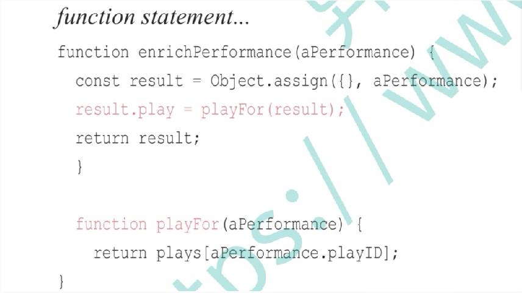

# 重构的重构 - 《重构》第二版导读

近20年过去了，Martin Fowler先生终于推出了新版的《重构》。本人有幸于ThoughtWorks技术雷达十周年峰会现场率先拿到了此书的国内发行版。

在这20年中，软件开发技术发生了很多重要的变化。新的编程语言不断涌现，老的编程语言也加快迭代。主流编程语言大都支持了多种编程范式，函数式编程和面向对象一样成了主流编程语言的标配。对并发的更好支持也已成为主流编程语言新的核心竞争力。于此同时各种软件开发工具也日益现代化，常用的编程IDE都具备了面向重构、测试甚至容器化发布的自动化工具和快捷键。

基于上，很多人都认为新版的重构会迎合时代的变化，焕然一新。然而当我用一整天时间读完全书后，却不禁如释重负。正如本书中文译者熊节先生所说“Flowler先生不仅没有拔高，反而把功夫做的更扎实了”。

确实，无论编程语言的语法如何变化、编程范型如何多元化、工具如何发展，软件设计的目标并没有变：那就是如何在保证软件满足功能和非功能需求的前提下，更易应对变化，更易让人理解和维护。由此所推导出来的软件设计原则则是几十年都没有变，如`高内聚、低耦合`，如`SOLID原则`等。甚至连`GOF设计模式`至今依然生命力旺盛，除了偶有在一些新的编程范型中出现的新模式以及对原有模式的更简单实现。此刻再回顾重构技术，它所传授的如何识别代码中的坏味道，以及如何采用小步安全的重构手法逐步将代码演化到更易理解、更易应对变化的状态，不正是为了满足软件设计的核心诉求吗？所以重构应该是和设计模式一样，是一种软件开发中历久而弥新的核心能力。

因此新版的《重构》在大的结构方面和第一版相似。首先从一个示例开始，先让读者从整体上体会重构的过程和效果。然后给出了重构的具体概念和原则。之后Martin老先生给读者列出了一份重要的代码坏味道清单并逐一诠释。随后用了一章篇幅来讲述如何搭建对重构来说至关重要的“自动化测试体系”。最后Martin用整本书近四分之三的篇章详细阐述了几十种关键的重构手法。

而在所谓的与时俱进方面，Martin则将更多的精力放在了对细节的持续优化上。首先直接可见的是新版删除了第一版中的最后几章：“大型重构”、“重构，复用与现实”，“重构工具”等，一方面是因为这几章中有些内容在今天看来已不是那么重要，其次所谓的“大型重构”其实仍旧是一系列小的重构手法的合理组合和持续应用。因此在第二版中Martin将重点放到了对重构手法的持续优化上。首先他将原本**22种**代码坏味道调整为**24种**。然后对于重构手法部分进行了重新分类和排布，以便更加内聚和操作连贯。新版保留了第一版中大部分的手法，增加了一些更加具体和有用的手法，同时对所有的描述和示例都进行了更加精致的优化。

除这些之外，整本书的示例语言也从Java换成了JavaScript。

本文接下来着重介绍新版中的上述变化。

## JavaScript

不少人认为第二版中将重构的示例语言由Java变为JavaScript，并不是一种妥当的选择。毕竟JavaScript作为一门动态脚本语言，并不适合较大规模的工业级软件产品。但我个人认为选择JavaScript是经过Martin深思熟虑的。

自从NodeJs将JavaScript带进了服务端开发，JavaScript就变成了一门前后端通吃的语言。此外，ES6标准将JavaScript变成了一门现代语言，语法上同时支持面向对象和函数式范式。最后JavaScript内置多种支持并发编程的特性，它的包管理工具和生态也都建设得非常好。相比其它语言，JavaScript的受众以及可应用的领域相对更加广泛一些。

由于动态语言的灵活性，一般IDE对动态语言的自动化重构支持的并没有静态语言那么好。正因如此，安全的手动重构步骤对对于动态语言来说会显得更加有意义。进一步，熟练掌握手动重构技巧，不仅能更好的理解重构的本质，对在其它一些主流编程语言下实施重构也非常有价值（例如C、C++、Python等）。

借助JavaScript的多范式语法特性以及动态类型的灵活性，很多重构手法可以做的更加简单和灵活。例如JavaScript支持在函数内嵌套定义函数，所以应用`Extract Method`手法时，可以先把新提来出来的子函数定义在调用它的函数内部，这样借助函数的闭包性可以减少函数间传递的参数数量。等到真正需要复用该子函数的时候再把它挪到外面。全书中类似的例子还有很多。

在书中，Martin使用了ES6的语法，不仅因为ES6标准为JavaScript引入了类和继承的语法糖，而且在很多细节上也能让代码更加清晰。例如书中对`const`和`let`关键字的大量使用等。但同时Martin也尽量避免使用其他程序员不太熟悉的JavaScript编程风格，例如JS独特的对象模型以及`generator`、`promise`和`await/async`等语法。

因为使用JavaScript的缘故，新版对“构筑测试体系”一章做了较大修改。Martin演示了如何使用JavaScript的测试框架`Mocha`和断言库`Chai`构筑自动化测试系统，以支持重构的安全实施。

## 代码坏味道

学好重构的关键在于掌握三个点：起点、手法和目标（可以参考我之前写的文章：[《高效重构（一）：正确理解重构》](https://www.jianshu.com/p/3b34f337eaee)）。

代码的坏味道清单为我们指出了重构的起点。当发现代码中有类似清单中所列的坏味道时，就暗示着这是一个应该实施重构的地方。由此可见代码坏味道清单的重要性。

Martin在新版中对这份清单进行了重新梳理。下表对比了两版之间的差异。

|**第一版**|**第二版**|**变化概要**|
|:-:|:-:|-|
|✗|神秘命名 `Mysterious Name`|新版增加，突出了好的命名对于代码的重要性|
|重复代码 `Duplicataed Code`|重复代码 `Duplicataed Code`|新版删除了对毫不相干的类中出现重复的描述，避免不合时宜的提取非本质重复|
|过长函数 `Long Method`|过长函数 `Long Function`|基本未变|
|过长参数列表 `Long Parameter List`|过长参数列表 `Long Parameter List`|新版提供了更多的重构解决方案|
|✗|全局数据 `Global Data`|新版突出了全局数据对代码耦合性的恶劣影响|
|✗|可变数据 `Mutable Data`|新版突出了适宜的不可变性对代码可维护性上的优势|
|发散式变化 `Divergent Change`|发散式变化 `Divergent Change`|新版提供了更多应对发散式变化的重构方案|
|霰弹式修改 `Shotgun Surgery`|霰弹式修改 `Shotgun Surgery`|新版提供了更多应对霰弹式修改的重构方案|
|依恋情结 `Feature Envy`|依恋情结 `Feature Envy`|新版对封装单元的表述不再仅仅针对类，扩展到函数和模块|
|数据泥团 `Data Clumps`|数据泥团 `Data Clumps`|基本未变|
|基本类型偏执 `Primitive Obsession`|基本类型偏执 `Primitive Obsession`|新版增加了`类字符类型变量`的危害，并精简了描述|
|Switch表达式 `Switch Statement`|重复的Switch `Repleated Switch`|新版承认第一版有些“矫枉过正”，这项重构的核心是消除**重复**的switch|
|✗|循环语句 `Loops`|凸显了在函数式下，循环有了更多的更具语义性的表达方式|
|平行继承体系 `Parallel Inheritance Hierarchies`|✗|平行继承体系其实是散弹式修改的特殊形式。为了不再突出面向对象，新版删去|
|冗赘类 `Lazy Class`|冗赘的元素 `Lazy Element`|新版中体现了冗余的未必只是类，可能是函数、模块等|
|夸夸其谈通用性 `Speculative Generality`|夸夸其谈通用性 `Speculative Generality`|基本未变|
|临时字段 `Temporary Field`|临时字段 `Temporary Field`|删除”为了特殊算法引入临时字段“的情况|
|过长的消息链 `Message Chains`|过长的消息链 `Message Chains`|基本未变|
|中间人 `Middle Man`|中间人 `Middle Man`|基本未变|
|狎昵关系 `Inappropriate Intimacy`|内幕交易 `Insider Trading`|新版中不再仅限于类之间的不恰当耦合，将描述范围扩大到模块|
|过大的类 `Large Class`|过大的类 `Large Class`|旧版中描述的`GUI大类`已经有些过时了，所以删除了|
|异曲同工的类 `Alternative Classes with Different Interfaces`|异曲同工的类 `Alternative Classes with Different Interfaces`|新版对所谓类的"异曲同工"解释的更加清晰|
|不完美的类库 `Incomplete Library Class`|✗|类库属于可扩展不可修改的代码，新版中把对类库的坏味道辨别和重构删掉了|
|纯数据类 `Data Class`|纯数据类 `Data Class`|新版提出了例外情况：当纯数据类不可修改且仅用于传递信息时|
|被拒绝的遗赠 `Refused Bequest`|被拒绝的遗赠 `Refused Bequest`|基本未变|
|注释 `Comments`|注释 `Comments`|基本未变|

如上，除了一些语言上的调整外，主要的变化如下：
- 更加注重对细节的打磨。新增一些小的明确的坏味道（如`Mysterious Name`、`Global Data`），去除了一些大的、稍显模糊或者可被分解的坏味道（如`Parallel Inheritance Hierarchies`、`Inappropriate Intimacy`）；
- 修正了一些之前不准确的描述。例如将`Switch Statement`更改为`Repleated Switch`。
  > 这个修改非常有意思，Martin在书中承认当年有些矫枉过正了！那时多少人看完重构，致力于消除代码中的每一处`if-else`和`swtich`！殊不知对于缺乏反射的静态语言，即使采用多态替换了条件分支，但是最后在工厂方法里拼装对象的时候还是会存在一个条件分支。这次总算是拨乱反正了！
- 弱化了面向对象和类的分量，更多使用兼顾通用化的定义（例如使用`模块`一词替代`类`）。
  > 关于这点，Martin Fowler在博客中曾如是说：
  > "在写这本书第一版的时候，把`类`视为是构建代码机制的主要结构已经成为主流。然而，现在我们看到其它结构发挥了更大的作用。在我看来，类仍然很有价值，但是重构已经比较少地以类为中心；我们要意识到，随着代码不断被重构，类也是可以变化的。"
- 在某些局部的点上，优先推荐了一些函数式的解决方案，例如`把loops替换为管道`。
  > 对于在新版中直接将`loops`定义为一种坏味道，个人认为是Martin新的一次矫枉过正。虽然管道和流在某些场景下比loops语义更清晰，但是不可否认在一些简单的场景下loops更加符合一般程序员的思维习惯。所以这得看具体的场景，一刀切有些不妥！不知道下一版中Martin会不会承认这类似第一版中的`Switch Statement`一样，是一次故意的“矫枉过正”。

## 重构手法

正确的实施重构手法是安全高效的达成重构目标的保障。

很多人认为学习重构只要掌握背后的思想就足够了，其详细繁琐的操作手法并不重要。于是乎现实中很多人在实际操作重构的过程中章法全无，一旦开始半天停不下来，代码很多时候处于不可编译或者测试不能通过的状态。有时改的出错了很难再使代码回到正确状态，只能推倒重来! 

实际上重构是一项非常注重操作过程的技术，能够正确合理地使用重构手法，安全、小步、高效地完成代码修改，是评价重构能力的核心标准。否则Martin老先生也不值得花费多达四分之三的篇章对重构手法浓墨重彩了。

新版将重构手法从原来的68种调整到61种。由于具体的重构手法数量较多，这里就不一一对比了，只介绍一些重要的变化点。

- 为了让重构手法间衔接得更加顺畅，新版中重新调整了重构手法的编排顺序；
  > 新版中将基本的常用重构放到了一章，起名叫做”第一组重构“，然后将其余的手法按照”封装“、”搬迁“、”数据“、”逻辑“、”API“以及”继承关系“进行了分类和排序；

- 为了保持概念的内聚和一致，对一些重构手法进行了重命名或者合并；
  > 例如将`引入Null对象（Introduce Null Object`改为`引入特例（Introduce Special Case）`
  > 将`函数改名（Rename Method）`、`添加参数（Add Parameter）`和`移除参数（Remove Parameter）`统一合并为`改名函数声明（Change Function Declaration）`；

- 通过调整原有的重构命名或者新增新的重构手法，让重要的重构同时存在正向和反向手法，以便可以在实践时更加灵活地决定重构的方向；
  > 例如将原来的`内联临时变量（Inline Temp）`和`引入解释性变量（Introduce Explaining Variable） `改名为`内联变量（Inline Variable）`和`提炼变量（Extract Variable）`；
    将`以函数取代参数（Replace Parameter with Methods）`修改为`以查询取代参数（Replace Parameter with Query）`，并为其引入反向重构`以参数取代查询（Replace Query with Parameter）`；

- 为了凸显重构之间的关联关系，每种手法的介绍里面增加了`曾用名`、`反向重构`和`示意图`
  > - `曾用名`指出该重构在第一版中的原有命名；
  > - `反向重构`指出该重构对应的的反向操作的手法名称，为重构之间建立起互逆关系；
  > - `示意图`是Martin为每个重构手法画的一副小图，形象化的展现每个重构的效果；
  > - 另外，建议在阅读时，除了关注每个重构手法的`做法`和`范例`外，最好能把`动机`部分也好好阅读下。`动机`部分介绍了”为什么要做“以及”什么时候不该做“这项重构，里面的很多思考都具有启发意义。

- 考虑到编程范式的多元化，新版的描述中弱化了面向对象中的类的概念，同时引入了和函数式相关的一些重构；
  > 在很多描述中，不再以`类`作为封装的主要手段，取而代之以`模块`作为主要称呼。
  > 增加`以管道取代循环（Replace Loop with Pipeline）`的重构；

- 考虑到”组合优于继承“，调整删除了一些和"重构到继承"相关的重构手法；
  > 例如删除了`提炼子类（Extract Subclass）`和`以继承取代委托（Replace Delegation with Inheritance）`等

- 由于JavaScript鸭子类型的语法特性，删除了一些不再适用的重构手法；
  > 例如删除了`提炼接口（Extract Interface）`、`塑造模板函数（Form Template Method）`和`封装向下转型（Encapsulate Downcast）`等

- 在某些重构的操作步骤里，利用了JavaScript的语法特性简化了重构的操作过程；
  > 书中经常使用两类JavaScript的语法特性：
    - **函数式**。JavaScript允许将函数作为参数和返回值，允许在函数里面嵌套定义函数以及支持匿名函数和闭包。所以在`提炼函数（Extract Function）`手法里面，先将提炼出来的新函数定义在调用它的函数的里面，这样借助函数的闭包性可以减少函数间传递的参数数量，等到真正需要复用该子函数的时候再将它挪出；而`以管道取代循环（Replace Loop with Pipeline）`重构，则完全依赖于语言支持匿名函数和闭包性。
    - **动态类型**。JavaScript支持灵活的对象模型，新版中很多重构手法会在操作过程中往对象里临时加入新的属性，以方便后面的重构过程。例如在`函数组合成变换（Combine Functions into Transform）`和`引入特例（Introduce Special Case）`中，都会看到引入了类似`enrichXXX`名称的函数对原有的对象进行动态扩充；

对于重构手法部分，Martin进行了精心的调整，修改和增加了很多描述和代码示例。上述只是其中一些比较明显的变动，更多细致的变化还请君仔细品读原书。

最后要说的是，书中介绍了多达六十多种重构手法，普通人很难把所有的重构步骤都牢记于心。此书可以当做一本重构名录，在使用时再反复翻书查阅。相信经过不断阅读和实践，慢慢会掌握重构手法背后的普遍原理和规律，逐渐做到”手中无剑，心中有剑“。我曾把所有的重构手法归结为四类基本手法，最后浓缩成了两个核心操作，并给出了在重构时合理编排操作步骤的方法规律以及指出如何利用`锚点`来简化重构操作。具体见[《高效重构（二）：掌握重构手法》](https://www.jianshu.com/p/58f4c61b1cb3)。

## 重构示例

给初学重构的朋友一个建议，那就是在读完全书后，最好能把第一章`重构，第一个示例`中的例子再自行做一遍。这个例子规模适中，代码极具样板性，很适合用来演练重构。

在第二版中，Martin考虑到很多新时代人类完全没有在影片出租店租影片的体验，所以将例子改为一个”为戏剧演出的客户打印账单“的例子。这个例子和第一版中”影片出租店打印小票“的例子结构基本类似。大家在练习的时候，可以仔细品味以下方面：
- 由**明确的代码变化方向**驱动重构的展开；
- 将大的重构目标**分解**为一个个小的对代码坏味道的重构过程；
- 在重构过程中执行**安全小步**的代码调整动作；
- 依赖**自动化测试**保护重构的安全性；
- 在重构的最后，代码面向新的变化方向重新变得满足**开放封闭性**；

最后再提一点：在书中，面对”账单打印格式“的变化方向，重构到最后产生了两个函数`renderPlainText`和`renderHtml`，它们分别用来计算普通文本和HTML格式的账单字符串。对于像我这样一个对重复代码”吹毛求疵“的程序员，往往会进一步消除这两个函数中出现的模式重复。这两个函数有相同的打印算法，都是先输出账单标题，然后逐一输出每个演出的具体细则，最后输出账单的汇总信息，而且每一步中所依赖的数据是完全一致的。基于此我们可以做进一步的重构：将打印算法的重复和打印格式的不同进行分离。完成这个重构后，代码将会变成一个策略模式：由通用的打印算法组合不同的打印策略。现实中这个重构是否值得做，完全在于在不同的账单格式下”打印算法相同“这个假设是否足够稳定。

感兴趣的同学可以在[https://github.com/MagicBowen/refactoring/tree/master/code/js](https://github.com/MagicBowen/refactoring/tree/master/code/js)中找到上述重构的代码示例.

## 写在最后

本文简单地介绍了第二版《重构》的一些变化，更多的精彩细节还是推荐大家阅读原书。这次中文版本还是由熊节先生主译，所以书的翻译质量依旧很高。第二版由异步图书出版，书质还是蛮不错的，又变成了硬皮封面，自然价格也有不小的上涨。但是相信对于想要提高编码能力的读者来说，此书绝对是物超所值的。

不过，还是有点小小的遗憾在这里吐槽一下。作为一个对代码整洁度要求较高的人，书中偶尔出现的代码缩进不对齐的问题会让我觉得有些刺眼。如果说有些缩进不对齐只关乎美感的话，那么如下的不对齐就会让人有些困惑于函数的定义位置了（没法一眼看出`playFor`函数是定义在顶层，还是在`enrichPerformance`的内部）。

最后让我们以一个小小的测验结束本文吧。Martin先生为每个重构手法都绘制了一副示意图，尝试猜猜下面每幅图对应的重构手法名称，以及将对应的正反手法连接起来吧：）

---

> - 作者：王博
> - Email：e.wangbo@gmail.com
> - Github：https://github.com/MagicBowen
> - 个人简书主页：https://www.jianshu.com/u/92b7d9879f20
>
> - **转载请注明作者信息，谢谢！**
